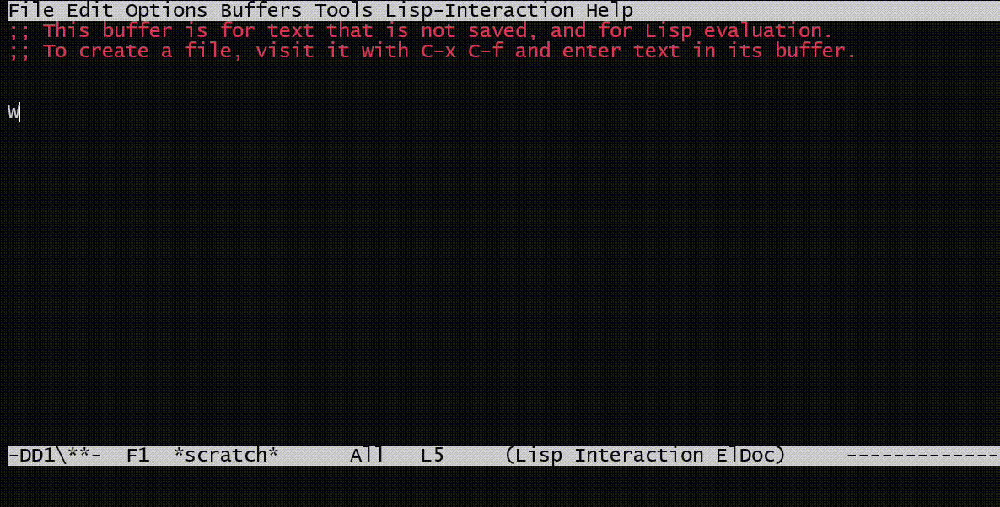

# genimi
A way to access Google Gemini API in Emacs. Fetch from the API on emacs.

# Installation

1. Download repository in local machine.
2. In the config file of emacs type:
   ```
   (add-to-list 'load-path "~/.emacs.d/genimi")
	   (require 'genimi)
   ```
3. Set Gemini API key using
   ```
   (customize-save-variable 'GeminiKey "<GEMINI_API_KEY>")
   ```
4. You are done.

# Usage

Genimi can be invoked using `C-c g` keys. It selects the text from the current line and sends as prompt to the Gemini server.


